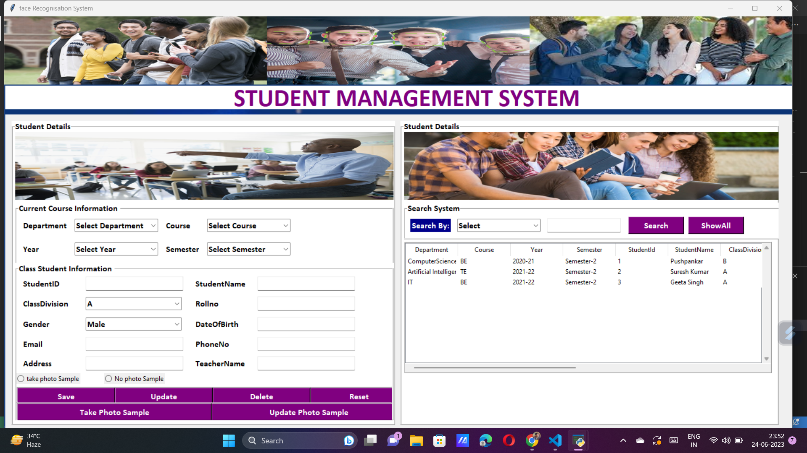
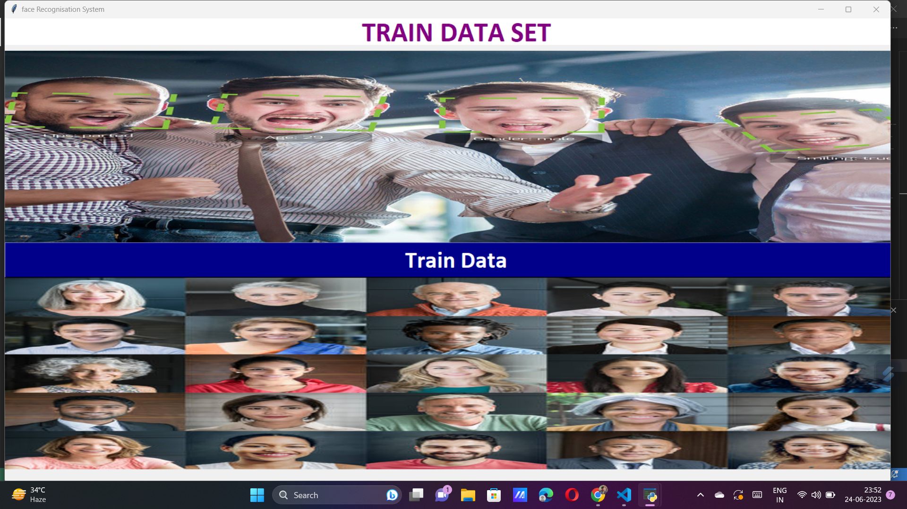
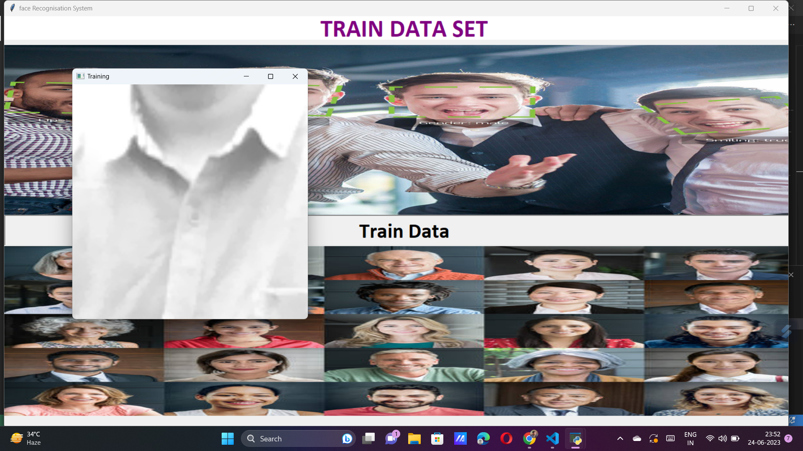
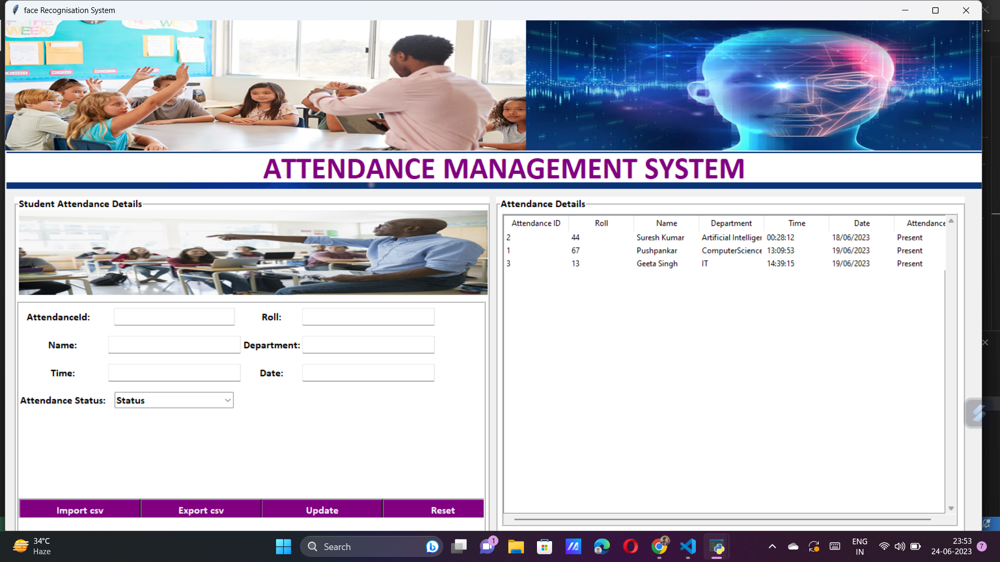
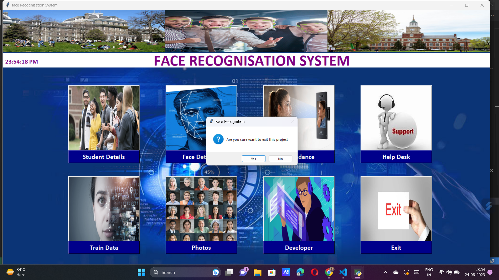

# Face-Recognition-Attendance-System
# Introduction
This project is a Face Recognition Attendance System developed using Tkinter, OpenCV, and Python. It aims to provide an automated and efficient way to manage attendance using facial recognition technology. The system utilizes the webcam to capture the faces of individuals, compares them with pre-registered faces, and marks the attendance accordingly.
# Features
Face detection: The system utilizes the OpenCV library to detect and locate faces in real-time captured frames from the webcam. 
Face recognition: It employs advanced machine learning algorithms to recognize and match the detected faces with the pre-registered faces in the database. 
Attendance tracking: The system maintains a record of attendance by storing the date, time, and associated student or employee information. 
User-friendly interface: The graphical user interface is developed using Tkinter, making it intuitive and easy to navigate. 
# Requirements
Python: Ensure that Python is installed on your system. You can download it from the official Python website. 
OpenCV: Install the OpenCV library to enable face detection and recognition. Use the following command: pip install opencv-python 
Tkinter: Tkinter is a standard Python GUI library. It is usually included with Python installations, so no additional installation is required. 
Additional libraries: Depending on your specific requirements, you may need to install additional libraries such as NumPy, Pandas, or SQLite. 
# Usage
Clone or download the project repository to your local machine. 
Install the required libraries mentioned in the "Requirements" section. 
Run the main Python file (main.py) to launch the application. 
The application will open with the GUI interface. 
Click on the "Register New User" button to register new faces in the system for attendance tracking. 
Use the "Start Attendance" button to begin the face recognition process and mark attendance. 
The system will match the detected faces with the registered faces and update the attendance record accordingly. 
You can view and export the attendance records as per your requirements. 
# Important Note
Ensure that the lighting conditions are optimal for face detection and recognition. 
Maintain a database of registered faces for accurate attendance tracking. 
Regularly update the face database to accommodate new members or changes in facial appearances. 
Feel free to customize and enhance this project according to your specific needs. Contributions and feedback are welcome! 

#UserInterface Images

#Other Section Images
 
 
 
 
#  After the face Recognition the attendance is
automaticaly Saved in Csv File
You can see in Attendance Section
By Import Csv with time and Date
 
 
 

